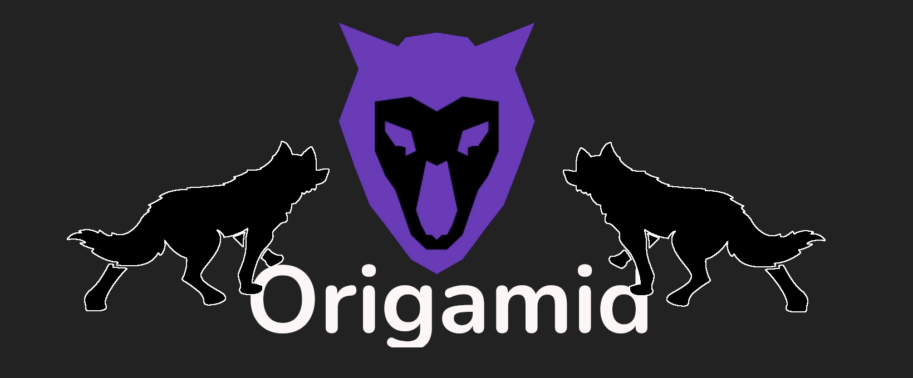

# Projeto Wildbeast

Esse repositório tem como objetivo mostrar mais um dos trabalhos desenvolvidos em cursos. O site do repositório foi desenvolvido no curso de CSS Grid do Origamid, que é centrado em desenvolver os conhecimentos aprendidos sobre css grid, os aplicando em um front end. O site Wildbeast é todo estilizado utilizando o disply grid.

Conhecimentos de propriedades como:

- grid-template-areas
- grid-template-columns
- grid-template-rows
- gap
- Entre outros
